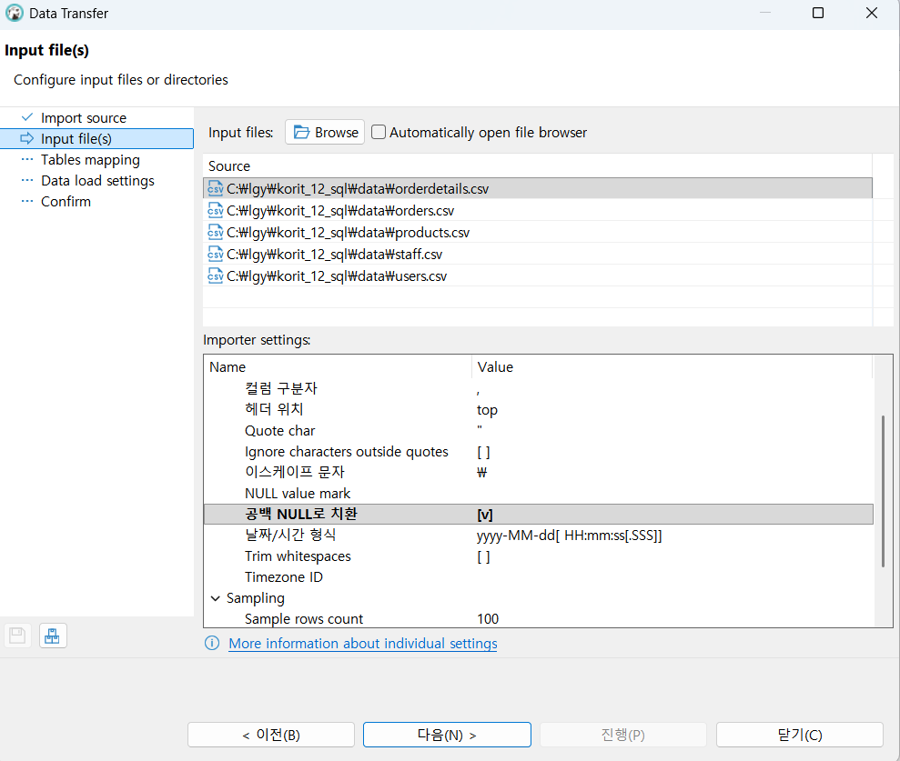

1. data.zip 압축 풀기
2. heidiSQL 열기
3. 도구 -> csv 파일 가져오기



# SQL문
- 최근에는 NoSQL 개념이 뜨고 있기는 하지만 대부분 IT 서비스 데이터가 저장되는 곳은
관계형 데이터베이스(Relational DataBase : RDB)인데, 해당 DB에 접근할 수 있는
프로그래밍 언어가 SQL(Structured Query Language : 구조화된 질의 언어)문입니다.
그래서 데이터가 저장된 곳은 특정 조건을 만족하는 데이터를 조회하는 부분을 옛날에는
개발팀에서 맡아서 했기에 다른 직군의 직원들이 개발팀에 요청해옴
  - 마케팅 부서에서 프로모션 기간 동안 매출 증가 자료를 개발팀에 요청
  - 개발팀은 해당 자료에 대한 SQL문을 조직해서 실행한 다음에 필요한 데이터를 뽑아
  - 업무 담당자에서 회신
하는 과정이었지만, 최근 개발직군이 아닌 다른 직군이 SQL을 직접 다루는 방식으로 스스로 처리하게끔 하고 있음.
  - 원래는 사내 DB를 일반 지구언들에게 오픈하는 걸 꺼려했는데 요새는 좀 다 오픈하는 분위기로 가다 보니 엄청 보수적인 곳이 아니라면 기본적으로 SQL 역량은 탑재
  - 그래서 특정 매출 자료를 분석하고 시각화해서 브리핑하면서 인사이트를 얻을 수 있도록 보조한다면 데이터 분석가가 되는 것.
  
  - 컴퓨터에게 데이터를 가져오라는 일을 시킬 때 그 형식이 어느 정도 정해져 있는 질의 언어로 컴퓨터에게 잘 시키는 언어, 라고 할 수 있음
  - 기본적으로 RDB를 다루기 위해 고안된 언어이기에 NoSQL에서는 조금 다른 방식으로 작동하는 경우가 있음 (NoSQL - 1. 아예 SQL을 안씀 / 2. Not Only SQL - SQL문만 써서 데이터베이스를 다루는게 아님 ) 그러다보니 개발자직군은 일반 직군으로 내려온 SQL으로 RDB 다루기 + NoSQL 역량이 필요하게 됨.

  - PC는 생각보다 멍청하기에 어디에서, 무엇을 가져와야하는지를 명시
  - 제가 예를 들어 여러분들에게 밥 먹고 합시다라고 얘기를 했을 때 수업 그만하자로 알아들으신 것과 달리 PC에게는 밥 메뉴가 정해져있지 않은데 밥 먹고 (무엇을) 한다는 건지도 명시해줘야 한다는 것. 그러면 밥먹고 합시다는 PC에게는 여러 오류를 일으킬 수 있다는 의미.

  - 데이터를 가져다 줘 전부 다
    저장소 위치가 어디냐면 table_table이야.
    명령 끝났다.

  - SELECT *
      FROM table_table
      ;
  이 되겠네요.

  그래서 간단한 튜토리얼을 확인하고 싶다면 w3school을 검색

## SQL의 종류
1. DML(Data Manipulation Language): 데이터 조작 언어라고 보통 번역되고,
DB의 내부 데이터를 관리하기 위한 기능. 주로 CRUD의 기능을 수행하기에 주요 명령어로
`INSERT, SELECT, UPDATE, DELECT`

2. DDL(Data Definition Language): 데이터 정의 언어로 번역되고, 
RDB 내의 저장 단위인 테이블과 컬럼을 정의하고 관리하는 명령어를 포함. 
저장 공간을 생성하고 수정하고 삭제하는 등의 저장 공간을 결정 (데이터를 추가 수정하는게 아님).
주요 명령어로는 `CREATE, DROP, TRUNCATE`

3. DCL(Data Control Language): 관리 목적으로 DB에 접근하려는 사용자의 권한을 관리하거나 보안과 관련된 기능을 담당 `GRANT, REVOKE`등이 있다.

4. TCL(Transaction Control Language): 트랜잭션 제어 언어이긴한데 저는 이걸 한국어로 본적이 없음. 
데이터베이스를 조작하는 명령 단위인 트랜션을 제어하고 관리할 때 사용하는 기능. 주요 명령어로는 `COMMIT, ROLLACK`등이 있다.

## 필수 개념
- 데이터베이스(DB): 데이터를 저장하고 관리하는 시스템. 고객정보, 주문내역, 재고관리 등의 정보를 저장.
- 관계형 데이터베이스(RDB): 데이터를 테이블 형태로 관리하는 데이터베이스.
각 테이블은 서로 키(KEY)를 기반으로 특정 관계로 연결되어 있음. 
가장 널리 사용되는 중.
- 테이블(TABLE): RDB 내에서 행(ROW)과 열(COLUMN)로 구성된 데이터를 저장하는 기본 단위. 
엑셀은 하나의 DB로 본다면 SHEET는 하나의 테이블
  각 테이블은 고유한 식별자인 키(PRIMARY KEY)를 가지고 있는데,
  _기본 키는 테이블 내에서 각 행을 고유하게 식별하기 위해 사용_ 됩니다. 
  또한, 테이블 간의 관계를 맺을 때는 _외래키(FOREIGN KEY)_ 를 사용.
- 컬럼(COLUMN): 테이블에서 하나의 속성(ATTRIBUTE)에 해당하는 데이터를 저장하는 공간으로 세로 줄인 열에 해당. 
컬럼에는 이름, 데이터 타입, 크기, 제약 조건 등이 정의
```java
@Entity
public class Person{
  private String name;
  private Integer studentId;
}
```
와 같은 클래스가 있다고 가정, 이를 객체 생성을 하고, 
DB에 저장했다면 Person 테이블에 각 컬럼이 name / studentID가 됨. 그러니까 컬럼명이 field가 될텐데, 
각 컬럼이 가지는 제약 조건으로 설정한 것이 -> private이고, 데이터 탕비이 string / Integer가 됨.

- 행(row): 테이블에서 가로줄을 의미하고, SQL에서는 레코드(record)라고 부르기도 함.
테이블에서 하나의 개별 데이터 단위를 나타내며, 특정 데이터가 저장되고 조회될 때 row 단위로 이루어짐.
```java
public class Main {
  public static void main(string[] args) {
    Person person1 = new Person('김일', 2026001);
  }
}
```
과 같이 객체를 생성했을 때 Person 테이블에 김일, 2026001이라는 row가 하나 생길 것.
즉 우리가 위에 적었던 record라는 가로줄 하나는 Java적으로 봤을 때 테이블 / 클래스명을 지니는 (Person) 클래스의 인스턴스(person1)에 해당한다고 볼 수 있음.

- 기본 키 (primary Key / PK): 기본 키는 테이블에서 각 행을 고유하게 식별할 수 있는 값.
기본 키는 하나가 아닌 여러 값의 조합으로 이루어지는 것도 가능. 
이러한 기본 키는 테이블 내에서 중복되지 않는 유일한 값을 가져야 함.

- 외래 키 (foreign Key / FK): 외래 키는 다른 테이블의 기본 키와 매칭되어 해당 테이블과의 관계를 정의함. 
다른 테이블의 기본 키 값을 가져와서 컬럼을 구성하며, 이후 테이블끼리 결합(JOIN)할 때 사용. 
일반적으로 다른 테이블의 기본 키와 같은 데이터 타입과 크기를 갖는다
(자료형이 동일하다는 것, 기본키는 )

# 원하는 데이터를 가지고 오고 필터링 하기
1. 데이터 처리 4 요소 : 생성 / 조회 / 수정 / 삭제 - CRUD
   SQL 뿐만 아니라 다른 프로그래밍 언어에도 데이터 처리 개념 자체는 존재
   SQL은 관계형 데이터베이스(RDB)의 데이터를 다루는 주요 언어에 해당

2. 이번 수업에서는 기본적으로 더미 데이터를 가지고 있는 상황에서 
   다양한 조건에 해당하는 데이터들을 필터링해서 가지고 오는 부분에 초점을 맞출 예정

## SELECT
  - 이상에서 작성한 '무엇'을 가져와야하는지에 해당.
  데이터적으로는 '어떤' 데이터를 보여줄지를 지정한다고 할 수 있음.

```sql
SELECT "HELLO SQL!";
```

- 이미 알고 계신 분들도 있겠지만 SELECT 문의 경우에는 어느 컬럼을 보여줄지를 지정하는 역할
하지만, FROM 절을 작성하지 않은 상태에서는 SELECT 뒤에 적은 문자열을 기준으로 컬럼명을 생성하고
내부에 row를 그대로 보여줌

* 참고 : 대소문자 구분 안함. 하지만 시험상황에서 보통 SQL 명령문은 대문자로 작성되기에
md 파일에 대문자로 SQL을, 데이터를 소문자로 작성

- SELECT : ~ 보여달라.
```sql
SELECT 'Hello, SQL!';
/* 보여달라 이 내용을 */
```
- 데이터 조회를 시작할 때 늘 SELECT로 시작하기에 CRUD 중 R 업무를 시작한다고 해석하셔도 무방
```sql
SELECT 12+7
```

- AS : 컬럼명을 지정할 때 작성하는 방버
```sql
SELECT 'Hello, SQL' AS 인사;
```

- 과제
  결과창의 첫 행(row)에 각각 Find / Insight / with SQL이라는 문구가 출력될 수 있도록 SQL문을 작성.
  단, 제목을 나타내는 컬럼명은 각각 순서대로 First, Second, Third로 작성하시오.
  (힌트 : 다수의 내용을 표시할 때에는 ','로 연결)
```sql
SELECT 'Find' AS 'First', 
       'Insight' AS 'Second', 
       'with SQL' AS 'Third';
```

AS가 없어도 뭐 그냥 나오기는 하지만 애초에 저희는 FROM 절을 이용해
TABLE을 조회할거이기에 깊게 다루지 않겠음. 다만 '컬럼명'을 바꿀 수 있다는 점은
집계함수의 적용 여부랑 합쳐져 매우 중요.

```sql
SELECT 'Hello, SQL' AS 인사;
```
이상의 경우 AS 뒤에 별칭을 지정할 때에는 DBMS를 타는 경우가 있긴한데
큰 / 작은 따옴표 여부를 따지지 않음

- 과제
  1. SELECT 활용 28+891 결과 표시
  2. 19*27
  3. 세 가지 결과를 각기 다른 컬럼으로 결과창에 표시
    - 37+172 (컬럼명 Plus)
    - 25*78 (컬럼명 Times)
    - I love SQL! (컬럼명 Result)

```sql
SELECT 37+172 AS 'Plus',
		   25*78 AS 'Times',
		   'I love SQL!' AS 'Result';
```

## FROM
1. 데이터가 저장된 위치를 알려주는 부분.
개발자가 PC에게 알려준다고 생각하는게 좋음.

```sql
SELECT * FROM users;
```

- `*` : 별표 / 와일드카드 / 애스터리스크라고 불리며 테이블 내의 모든 컬럼을 지시
(나중에 JAVA / SpringBoot에서도 쓸것임.)
  - Python에서 hangman할 때 `from hangman_arts import *`에서 사용

- `*`는 패턴 매칭에서 하나 이상의 문자를 대체할 수 있는 기호를 의미.
패턴 매칭이랑 문자열, 파일, 데이터 등에서 주어진 패턴이나 규칙에 맞는 부분을 찾아내는 과정으로 예를 들어 `*.text`라면 모든 text 파일 확장자를 지닌 애들을 가리킴.

- 개행과 들여쓰기는 python과 달리 아무런 영향을 끼치지 않음.
그냥 가독성 때문에 사용하는건데 이게 회사마다 쓰는 방법이 고착되어 있어
유연하게 작성하는 방법을 익히는게 좋음

```sql
SELECT * FROM users LIMIT 3;
```
전체 데이터가 아닌 일부 데이터만 가져오기 위해 개수를 지정하는 명령어로
`LIMIT`를 사용. 어느 DB를 쓰는가에 따라 다른데 `TOP`쓰는 곳도 있음.

full scan : 특정 테이블의 모든 정보를 조회하는 것을 저희야 모의 데이터를 쓰지만
인스타그램 회원 정보를 풀스캔한다고 치면 PC에 부담이 많이 됨.
그래서 단순히 데이터를 파악하고 싶다면 LIMIT / TOP 쓰는 습관이 정신건강에 좋음.

- 과제
  1. orderdetails 테이블의 전체 컬럼을 표시.
  2. users에서 상위 7건 데이터만 표시
  3. orders에서 주문 아이디 / 회원 아이디 / 주문 일자 컬럼의 모든 데이터를 표시
```sql
SELECT id, user_id, order_date FROM orders;
```

## Where 절
  1. 어떤 것을 고를지 설정.
  - SELECT / FROM에서 보여줄 내용을 지정, 가져올 테이블을 정했는데,
  LIMIT를 통해 일부 개수만 가지고 오는 방식이 아니라, 어떤 컬럼의 값이 A인 것만
  가져온다든지, 성별이 여자인 회원만 가져온다든지, 또는 배송비가 무료인 것만 가져온다든지하는 일종의 filter를 거쳐야 하는 경우가 있음. 이럴 때 사용하는게 Where절에 해당. Where절은 조건을 만족하는 데이터만 가져오도록 제한

  2. SELECT 절에서는 세로 부분인 컬럼을 제어했다면 (필요한 컬럼만 뽑아낼 수 있었으니.) Where절에서는 특정한 row만 가지고 오도록 제어

  3. 회원 정보 테이블에서 거주 국가가 Korea인 회원만 추출하기
```sql
SELECT * FROM users WHERE country = 'Korea';
```

  - 데이터 전처리 : 혹시 회원이
  Republic of Korea로 등록했는지
  South Korea로 등록했는지
  Korea로 등록했는지 등.

  그렇다면 한국이 아닌 회원의 전체 컬럼 출력
  ```sql
  SELECT * FROM users WHERE country != 'Korea';
  ```
  - `!`가 not 연산을 한다는 것 확인
  - 논리 연산자 `AND` / `OR`도 존재

  users에서 거주국가가 한국이면서 회원 아이디가 10인 회원만 추출.
  ```sql
  SELECT * FROM users WHERE country = 'Korea' AND id = 10;
  ```

users에서 가입일시가 2010-12-01부터 2011-01-01인 회원 정보 출력

```sql
SELECT * FROM users WHERE created_at BETWEEN '2010-12-01' AND '2011-01-01';
```

- `BETWEEN`은 실제 쿼리 작성 시 날짜 조건을 적용할 때 자주 사용.
[시작날짜]와 [종료날짜]를 포함한 그 사이 값을 조회하는데,
created_at의 결과값들을 확인해보면 yyyy-mm-dd HH:MM:SS 형태로 작성이 되어있는데, 
조건을 '년월일'까지만 작성한다면 시/분/초 조건을 0으로 인식하여 알아서 계산


- 문제 : 회원정보테이블에서 가입 일시가 2010-12-01부터 2011-01-01까지인 회원정보 전체 컬럼을 출력하는데
BETWEEN은 쓰지 말고 작성
```sql
SELECT * FROM users WHERE created_at >= '2010-12-01' AND created_at <= '2011-01-01';
```

- users에서 거주 국가가 Korea이나 UK거나 USA인 회원정보만 추출
```sql
SELECT * FROM users WHERE country = 'Korea' OR country = 'UK' OR country = 'USA';
SELECT * FROM users WHERE country IN ('Korea', 'UK', 'USA')
```
- 일반적인 생각나는 방법도 가능하고 혹시 python적으로 생각나는게 있으면
걔도 가능하긴 합니다, 그때 `()`를 씁니다.
- 기억이 안나시는 분들은 [28, 30, 31]list 있던 문제를 보시면 됩니다.

* 참고 사항 : AND / OR 연산자 중에 AND가 더 우선순위가 높음
  - 우선순위가 높다는 것은 WHERE 절 내에서 실행되는 순서가 더 빠르다는 뜻.
    그래서 AND / OR을 한 WHERE절 내에서 동시에 작성할 경우 AND 조건이 먼저 실행

- `!`만 있는게 아니라 `NOT`도 존재.

- 문제 : users에서 국가가 한국도 영국도 미국도 아닌 회원종보를 추출
```sql
SELECT * FROM users WHERE country != 'Korea' OR country != 'UK' OR country != 'USA';
SELECT * FROM users WHERE country NOT IN ('Korea', 'UK', 'USA');
```

- 예시 users에서 거주 국가가 S로 시작하는 회원정보 추출

```sql
SELECT * FROM users WHERE country LIKE 'S%';
```

- `LIKE` : WHERE 조건문을 작성할 때 일부 패턴에 일치하는 데이터만 검색할 수 있다는 점에서 가치가 있음.
LIKE 뒤의 '' / "" 뒤에서는 와일드카드를 사용할 수 있는데, 여기서는 `%`를 의미
%는 0개 이상의 임의의 문자욜 패턴을 의미하는 메타 문자에 해당함
`_`는 임의의 문자 한개를 의미.

```sql
SELECT * FROM users WHERE country LIKE 'U_';
```
- 그래서 이상의 결과값으로 UK만 나오지 USA는 추출되지 않음.

- 문제 : users에서 거주 국가의 이름이 S로 시작하지 않는 회원 정보만 추출

- 예시 : users에서 가입일시 컬럼의 값이 null인 결과만 출력
```sql
SELECT * FROM users WHERE created_at IS null;
```

- `null` : 값이 없는 상태를 의미. 0이거나 ''(공백)도 아님.
진짜 아무런 값도 없다는 의미로 쓰이기에 JAVA에서 int a; 한 다음 System.out.println(a)하면 0 나오는것과 다름.

- `IS` : null은 0도 아니고 ''도 아니기에 어떤 조건값으로도 _조회할 수 없습니다_ 
이러한 null 값을 필터링할 때 쓰이는 조건 연산자가 IS임.

- 문제 : users에서 created_at이 null이 아닌 것만 추출
- 주의사항 : 영어 어순을 고려할 필요
```sql
SELECT * FROM users WHERE created_at IS NOT null;
```

- 문제 
  1. users에서 거주 국가가 멕시코인 회원정보를 가입일시, 연락처, 거주도시, 거주국가 컬럼만 출력
  ```sql
  SELECT created_at, phone, city, country FROM users WHERE country = 'Mexico';
  ```

  2. products에서 제품 아이디가 20이하이고, 정상가격(price)은 30 이상인 제품의 정보를 출력하시오,
  단, 기존의 컬럼모두 출력하는데, 정상 가격에서 얼마나 할인 되었는지를 discount_amount라는 컬럼명으로 이름 지으시오.
  ```sql
  SELECT *,
       	(price - discount_price) AS discount_amount
        FROM products
        WHERE id <= 20 
        AND price >= 30;
  ```

  3. users에서 거주국가가 한국/캐나다/벨기에가 아닌 회원정보를 OR 연산자를 사용하지 않고 출력
  ```sql
  SELECT * FROM users WHERE country NOT IN ('Korea', 'Canada', 'Belgium');
  ```

  4. products에서 제품명이 N으로 시작하는 제품의 정보를 출력하는데, 제품아이디, 제품명, 정상가격 컬럼만 출력
  ```sql
  SELECT id, name, price FROM products WHERE name LIKE 'N%';
  ```

  5. orders 테이블에서 주문일자가 2015-07-01부터 2015-10-31까지가 _아닌_ 정보만 출력
  ```sql
  SELECT * FROM orders WHERE order_date NOT BETWEEN '2015-07-01' AND '2015-10-31';
  ```

# 내일의 수업 내용 부분
ORDER BY