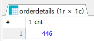
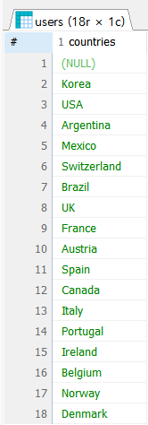
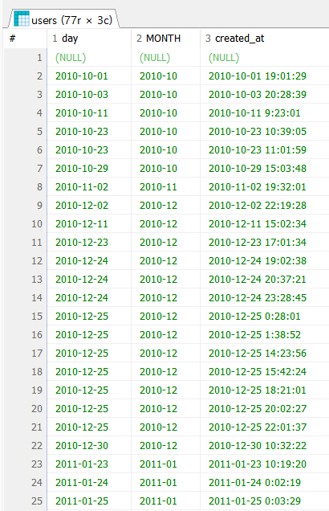
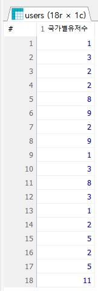

# SQL 기본
## ORDER BY
- 어떤 순서로 볼까? 
  1. 문자를 오름 / 내림 차순
  2. 숫자를 오름 / 내림 차순

- 예제 문제 : users에서 id 기준으로 오름차순 정렬
```sql
SELECT * FROM users ORDER BY id ASC;
```
- ASC (ascending) : 오름 차순
- DESC (descending) : 내림 차순

- city 기준으로 오름 차순 정렬
```sql
SELECT * FROM users ORDER BY city ASC;
```

- created_at 기준으로 내림 차순 정렬
```sql
SELECT * FROM users ORDER BY created_at DESC;
```

- ORDER BY는 컬럼명을 몰라도 정렬을 수행하는 것이 가능.
  _몇 번째 컬럼인지 숫자로 입력해도 가능_ 하다는 점.

- users 테이블의 첫 번째 컬럼 기준으로 내림차순 정렬
```sql
SELECT * FROM users ORDER BY 1 DESC;
```

- 문제 : users 테이블에서 username, phone, city, country, id를 순서대로 보여줄 수 있도록
  select문을 작성하고, 첫 번째 컬럼을 기준으로 오름차순 정렬
```sql
SELECT username, phone, city, country, id FROM users ORDER BY 1 ASC;
```

- 만약에 id를 기준으로 오름차순 되기를 바랐다면
  결과값이 생각한 대로 나오지 않았을 것.
  ORDER BY 절의 실행 순서를 파악해야 할 필요가 있는데,
  _SELECT 절의 실행 결과를 기준으로 정렬_ 하기에 
  이상의 쿼리문을 기준으로 했을 때는 1번 컬럼이 username이 되어,
  username varchar 기준으로 오름차순 정렬되었다고 해석.

- SELECT로 컬럼 순서를 바꿨지만 id 순서로 asc 하기 위해서는
  컬럼명을 명시하는 것이 좋음.
```sql
SELECT username, phone, city, country, id FROM users ORDER BY id ASC;
```

- ORDER BY의 기준을 복수로 잡는 것도 가능.
  한 개 이상의 정렬 기준을 잡을 수 있음.
  `ORDER BY 1번 컬럼 ASC/DESC, 2번 컬럼 ASC/DESC`
  와 같은 방식으로 작성할 수 있는데,
  이상의 경우 1번 컬럼을 기준으로 먼저 정렬을 수행한
  다음에 2번 컬럼에서 재정렬 수행

- users에서 city, id 컬럼만 출력하고,
  거주 도시 기준으로 내림차순,
  회원 아이디 기준 오름차순 정렬
```sql
SELECT city, id FROM users ORDER BY city DESC, id ASC;
```

- 이상의 ORDER BY 부분을 해석하면,
  먼저 city 기준으로 내림차순 정렬한 뒤,
  동일한 city 값 내에서는 id를 기준으로 오름차순 정렬하라는 의미.
  그렇다면 ORDER BY 이후에 명시하는 컬럼명의 순서도 신경쓸 필요가 있다는 것을 확인

### 문제 
1. products 테이블에서 정상 가격이 비싼 제품부터 순서대로 모든 컬럼 출력
```sql
SELECT * FROM products ORDER BY price DESC;
```
2. orders에서 주문 일자 기준 최신순으로 정렬하여 모든 컬럼 출력
```sql
SELECT * FROM orders ORDER BY order_date DESC;
```
3. orderdetails 테이블에서 제품 아이디를 기준으로 내림차순 정렬하고 같은 제품 아이디 기준으로
   판매 수량을 기준으로 오름 차순 정렬하여 모든 컬럼을 출력
```sql
SELECT * FROM orderdetails ORDER BY product_id DESC, quantity ASC;
```

### SELECT / FROM / WHERE / ORDER BY 수준에서의 실무 예시
- 배달 서비스에서 어떤 방식으로 적용하는가?
1. 2023-08-01에 주문한 내역 중 쿠폰 할인이 적용된 내역만 추출
```sql
SELECT *
  FROM 주문정보
  WHERE 주문일자 = '2023-08-01'
  AND 쿠폰할인금액 > 0;
```

2. 마포구에서 1인분 배달이 가능한 배달 음식점만 추출
```sql
SELECT *
  FROM 음식점 정보
  WHERE 지역 = '마포구'
  AND 1인분가능여부 = 1;
```

- 전자책 서비스를 어떻게 쓰는가?
1. 출간된 지 한 달 이내인 신간 중 페이지 수가 200 이상인 도서만 추출
```sql
SELECT *
  FROM 도서정보
  WHERE 출판일자 >= (오늘일자 - 1달)
  AND 페이지 수 >= 200;
```

2. 최근 한달 이내에 도서 구독 멤버십에 가입한 회원만 추출
```sql
SELECT *
  FROM 회원정보
  WHERE 가입일자 >= (오늘일자 - 1달)
  AND 멤버십가입여부 = 1;
```

- 참조 사항 : 오늘 일자를 가져오는 부분과 특정 일자에서 한 달 차감하는 함수가 DB 별로
              다를 수 있기에 정형화해두지 않음.
              조직 별 DB 채용한 것을 기준으로 학습할 필요가 있음.

# 묶어서 계산하기
## 데이터를 계산하는 함수
- 엑셀에서 합 / 평균 / 개수 세는 등의 작업을 할 때 함수를 사용해본 적 있을 것임.
  SQL에서도 마찬가지로 함수를 사용해 동일한 작업을 할 수 있음.
    - 합 / 평균 / 개수 세는 등의 _집계함수_
    - 문자열을 잘라내거나 / 대소문자 변경 등을 수행하는 _일반 함수_ 등이 존재.

- 그룹 별로 _집계 함수를 적용하기 위해 데이터를 나누는_ GROUP BY
  - 전체 데이터에 함수를 적용하기도 하나(이하와 같이), 그룹별로 수치를 도출하는 일이 자주 있음
    그런 경우 GROUP BY를 이용해 데이터를 그룹으로 묶은 후 필요한 함수를 적용하면 됨
```sql
SELECT COUNT(id) AS cnt FROM orderdetails;
```
  - 이상의 코드 경우는 orderdetails의 전체 건수를 확인하는게 되겠지만
    product_id를 기준으로 적용한다든지 등의 일부 컬럼을 가지고 세세한 개수를 파악하는 것은 쉽지 않음.
  - 하지만 GROUP BY를 적용했을 때는 '국가별 회원 수를 계산하기' 혹은
    '일별 매출을 계산하기' 등으로 좀 더 세분화해서 사용할 수 있음.

- GROUP BY로 계산한 결과를 필터링하는 HAVING
  - GROUP BY를 사용하는 국가 별 회원 수를 추출하는 것은 가능한데,
    그 중에서 마케팅 효율을 높이기 위해 국가 별 회원 수 추출하고,
    그 중에서 회원수가 10명 이상인 국가만 재추출하는 등 
    _집계 함수로 계산한 결과 중에서 조건에 맞는 데이터만 필터링_
    하는 경우도 존재.
  - 그러면 일반 집계 함수가 적용된 이후에 WHERE을 써야 한다는건데,
    집계되기 전에 미리 생각하고 WHERE 절을 설계하는 것이 쉽지 않기에 
    _GROUP BY 집계 함수의 `결과값`을 필터링할 때는 `HAVING`_

## 집계 함수
  1. COUNT : row 개수 세는 거
  2. AVG : 평균
  3. SUM : 숫자형 데이터 값을 더할 때
```sql
SELECT COUNT(*) FROM users;
```
이상의 쿼리문은 회원 테이블의 row 개수를 추출합니다. `COUNT(*)`는
대상 테이블에 있는 전체 행의 개수를 세는 역할함.

- users에서 존재하는 국가의 수를 카운팅
```sql
SELECT COUNT(country) FROM users;
```
- 전체 row의 개수는 77개이지만, 
  더미 데이터 기준 1번 row가 country가 null 이기에 76으로
  출력되는 것을 확인


- 이상에서 알 수 있는 것은 COUNT 함수는 컬럼의 값이 null이 아닌
  행의 개수를 return한다고 할 수 있음.
- 그런데 잘 생각해보시면 금일 수업 중 도시 기준으로 내림차순했을 때
  Seoul이 여러 개 였으니, Korea도 여러 개 일 것.
  그러면 중복을 포함하여 카운팅 되었다고 생각할 수 있음.
- 중복 제거 명령어 `DISTINCT`

- 예시 : users에서 존재하는 국가를 세어보기 (중복 제거)
```sql
SELECT COUNT(DISTINCT country) FROM users;
SELECT DISTINCT country AS countries FROM users;
```

이상의 이미를 확인했을 때 18이라고 출력되지만 COUNT() 적용했을 때 17이 나옴.
null은 집계함수 상에서 카운팅이 되지 않는거지 그냥 보여줄 때는 그대로 나옴.
그래서 count() 적용결과는 17이고, 미적용 시 18번 row까지 존재.

- MIN() : 최저값 추출 / 문자열에도 사용 가능
- MAX() : 최대값 추출 / 문자열에도 사용 가능

1. 제품 정보 테이블에서 최저가를 추출하시오 (정상가 기준)
```sql
SELECT MIN(price) FROM products;
```
2. 제품 정보 테이블에서 최대가를 추출하시오 (할인가 기준)
```sql
SELECT MAX(discount_price) FROM products;
```
3. 제품 정보 테이블에서 정상가격의 합계를 추출하시오
```sql
SELECT SUM(price) FROM products;
```
4. 제품 정보 테이블에서 정상 가격의 평균을 추출하시오 
(단, 결과값의 컬럼영을 avgPrice로 변경하고 소수점 둘째 자리까지만 추출)
  - ROUNT() 함수 -> 사용법은 python과 같음.
```sql
SELECT ROUND(AVG(price),2) AS avgPrice FROM products;
```
- 예시 : users에서 회원의 가입일자(일), 가입년월(년), 가입일시(created_at)만 출력
```sql
SELECT SUBSTR(created_at, 1, 10) FROM users;
```

- SUBSTR(p1, p2, p3) :
  - p1 : 잘라내기를 할 때 VARCHAR() 자료형
  - p2 : 시작인덱스 (1번부터)
  - p3 : 종료인덱스 (안쓰면 끝까지 추출)


```sql
SELECT SUBSTR(created_at, 1, 10) AS day, 
       SUBSTR(created_at, 1, 7) AS MONTH, 
       created_at FROM users;
```

- 예시 : users에서 username의 문자열의 길이
```sql
SELECT LENGTH(username), username FROM users;
```
  - LENGTH() : len()와 동일.
    문자열의 길이를 return하는 것이 동일
    그런데 DB 종류에 따라 LEN()으로 쓰는 것도 있음.
  - UPPER() : 대문자 변경
  - LOWER() : 소문자 변경

### 집계함수 종류(중 일부)
  1. SUM
  2. AVG
  3. MAX
  4. MIN
  5. COUNT

### 일반 함수(중 일부)
  1. ROUND(p1, p2, p3)
  2. SUBSTR(p1, p2, p3)
    - p2 시작 위치
    - p3 가져올 문자열의 개수ㅌㅌ
  3. LENGTH
  4. UPPER
  5. LOWER

- 집계 함수는 여러 행의 데이터를 하나의 결과값으로 _집계_ 하는 반면,
  일반 함수는 _한 행의 데이터에 하나의 결과값_ 을 대상으로 함.
  따라서 **집계 함수는 SELECT에서만 사용 가능
  허나 일반 함수는 SELECT에서도 사용 가능
  WHERE 절에서도 사용가능**

- 문제
1. products에서 정상 가격을 모두 더한 값을 추출
```sql
SELECT ROUND(SUM(price),2) AS '합계' FROM products;
```
2. products에서 제품 아이디가 30이하인 제품의 정상 가격의 평균 추출(소수점 둘째)
```sql
SELECT ROUND(AVG(price), 2) AS '평균' FROM products WHERE id <= 30;
```
3. users에서 가입일시가 2010-10부터 2010-12까지인 회원 아이디를 중복 없이 센 값을 출력
```sql
SELECT COUNT(DISTINCT id) AS '유저수' FROM users WHERE SUBSTR(created_at, 1, 7) BETWEEN '2010-10' AND '2010-12';
```
  - 이상의 경우에서 SUBSTR()을 적용한게 좀 더 모범답안에 해당.
    그 이유는
    1. YYYY-MM-DD HH:MM:SS 로 잡았을 때 공백을 기준으로
    연월일 / 시간으로 잡는데 YYYY-MMM을 기준으로 잡는 부분이 설정되지 않음.
    그래서 명시적으로 잘라주는 것을 기준

4. users에서 이메일의 길이가 17자리 이하인 회원 수를 중복없이 센 값을 출력.
```sql
SELECT COUNT(DISTINCT id) AS '유저수' FROM users WHERE LENGTH(username) <= 17;
```

## GROUP BY
이상까지의 수업 내용에서 SELECT문에 집계함수를 적용하고,
일반 함수를 SELECT와 WHERE절에서 사용해봄.
집계함수를 SELECT절로 쓰게 될 경우 데이터 전체가 아니라
원하는 기준으로 그룹을 나눠서 계산하기가 어렵다든지,
전체 회원수를 나눈다든지 할 때가 됨.

  - Korea는 몇명인지,
    USA는 몇명인지 하려면 기존에는

  1. country가 Korea인 애 카운트
  2. country가 USA인 애 카운트
  한 다음에 사람이 직접 더해야 함.

1. , 2. 과정을 거친 다음에 답을 md 파일에 작성
```sql
SELECT COUNT(id) FROM users WHERE country = 'Korea';
SELECT COUNT(id) FROM users WHERE country = 'USA';
SELECT COUNT(id) FROM users WHERE country IN ('Korea', 'USA');
```
총 몇명: 19명

이상의 코드에서 생겨나는 문제가 뭐냐
기본적으로 country 내에 무슨 값이 있는지를 한 번 체크해야 한다는 부분

- 예시 문제 : users에서 국가 별 회원 수를 추출
```sql
SELECT country, COUNT(DISTINCT id) AS 국가별유저수 FROM users GROUP BY country;
```
이상의 쿼리문을 실행했을 때 국가별 회원 수를 확인할 수 있음.
GROUP BY는 _집계 함수와 함께_ 사용되며 GROUP BY 기준 컬럼은 
SELECT에서 집계 함수를 사용할 때 묶어서 계산을 수행하는 기준

- SELECT 절에만 집계함수를 사용 가능
- GROUP BY를 명시하지 않았을 때는 전체 row를 기준으로 집계 함수가 일어남
-> 테이블 전체를 기준으로 id 개수를 세든지 총합을 구하든지,
최대값, 최소값을 출력하든지 하게 됨.
- GROUP BY 컬럼명을 명시하게 될 경우에는 해당 컬럼의 중복되는 row값들을 다 합침.
  그렇다면 GROUP BY까지 포함한 쿼리문의 연산 결과에 대한 전체 row의 개수를 미리 알수 있음.
  ```sql
  SELECT COUNT(DISTINCT country) FROM users;
  ```
- 거기에 GROUP BY 컬럼명 a을 작성했다면 가시성을 위해 SELECT문에도 컬럼명 a를 명시해주는 것이 어떤 값에
  집계함수 결과가 무엇인지를 명확히 보여주는 방법이 될 것.

- 이하는 GROUP이 이루어질 column을 명시하지 않았을 때 가시성이 박살난 결과값


- 문제 1 : 거주 국가가 한국인 회원중 마케팅 수신에 동의한 회원 수를 추출

- 문제 2 : 영국인 회원 중 마케팅 수신에 동의한 회원 수를 추출

1, 2의 경우 GROUP BY 필요 없음

- 문제 3 : 국가별로 마케팅 수신 동의를 한 회원 수를 국가별 오름차순, 회원수 별 내림차순으로 추출
  (컬럼명 동의사용자)

이상의 코드에서 여러분이 주목해야 할 점은 order by 부분에서 '동의사용자 DESC'부분
원래 is_marketing_agree 라는 이름의 column이 있기에 우리가 재가공한 이름을 기준으로
내림차순 정렬을 할 수 있는가 여부가 중요하다고 할 수 있음.

  - 이미 굴려봤을 때 실행이 된다는 점에서 우리가 주목해야 할 점은 다음
    - order by문은 select까지의 sql문의 연산을 한 결과를 바탕으로 '재정렬'시켜주기에
    select절에서 column명을 바꾼 것을 기준으로 순서를 정렬
    - 그러면 select 절의 경우 모든 연산이 다 끝난 이후에 맨 마지막으로 order by가 실행된다는 점은 도출 가능