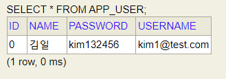

# 커리큘럼 50% 시점 : 3월 2일
1. 2월 19일 : SQL 과목 두 개
2. 2월 24일 : 스프링 부트 관련 두 개 과목 (시험 변동 예정 - 뒤로 미룰 예정)

# DDL
## CREATE : 테이블 생성
- 테이블을 만들 때는 각 컬럼의 데이터 타입과 제약조건을 설정할 필요있음

```sql
-- 1. CREATE : 테이블 생성
CREATE TABLE students (
	student_id INT AUTO_INCREMENT PRIMARY KEY,
	full_name VARCHAR(50) NOT NULL,
	email VARCHAR(100) UNIQUE,
	birth_date DATE,
	created_at TIMESTAMP DEFAULT CURRENT_TIMESTAMP
);
```

## ALTER : 테이블 수정
- 이미 만들어진 테이블에 새로운 컬럼을 추가하거나
  타입을 변경할 때 사용
```sql
-- 컬럼 추가
ALTER TABLE students ADD phone VARCHAR(20);

-- 컬럼 데이터 타입 수정
ALTER TABLE students MODIFY COLUMN full_name VARCHAR(100);
```

## DROP : 테이블 삭제
- 테이블 자체를 완전히 삭제
  (복구가 어려움.)
```sql
-- 테이블 삭제
DROP TABLE students;
```

# DML (Data Manipulation Language)
- 데이터를 직접 조작하는 create(INSERT), read(SELEECT), update(UPDATE), delete(DELETE) 단계

## INSERT : 데이터 추가
- 데이터를 삽입할 때는 컬럼 순서와 데이터 타입을 일치시켜야 함.
```sql
-- INSERT
-- row 하나만 삽입한 예시
INSERT INTO students (full_name, email, birth_date)
 	VALUES ('김일', 'kim1@test.com', '2026-02-26');
	
-- 여러 rowo를 한꺼번에 삽입
INSERT INTO students (full_name, email)
	VALUES ('김이', 'kim2@test.com'),
			 ('김삼', 'kim3@test.com');
```

## UPDATE : 데이터 수정
* 참조 사항 : `WHERE`절 생략 시 테이블의 모든 행이 수정됨.
```sql
-- UPDATE
UPDATE students SET birth_date = '1990-01-01'
	WHERE student_id = 2;	

UPDATE students SET phone = '010-8625-7953'
	WHERE student_id = 3;
```

## DELETE : 데이터 삭제
* 참조 사항 : 마찬가지로 `WHERE`을 이용해 특정 row만 삭제해야함.
  고유값 (PK)의 의미가 중요한 이유.
```sql
DELETE FROM students WHERE student_id = 4;
```

# 통합 과제 
1. 이하의 테이블들을 생성하시오.
  - courses
    - course_id : 자동증가 적용 / PK 적용 / int
    - coures_name : 문자열 (100) / not null 적용
    - professor : 문자열 (50)
    - creadits : int default 3

  - enrollments
    - enrollments_id : 자동증가 적용 / PK 적용 / int
    - student_id : int / fk 적용
    - course_id : int / fk 적용
    - enrollments_date : DATE

2. 더미 데이터 삽입
    - courses 테이블에 
      - 데이터베이스 기초 / 강교수 / 3
      - 자바프로그래밍 / 이교수 / 4
      - 웹 디자인 / 박교수 / 2

    - enrollments의 student_id / course_id / enroll_date에
      - 1, 1, '2026-02-01'
      - 1, 2, '2026-02-01'
      - 2, 1, '2026-02-02'

1. Create (데이터 추가)
문제 1.1: 새로운 학생 '박지민'(park@test.com, 1995-05-05, 010-5555-6666)을 students 테이블에 추가하세요.
```sql
INSERT INTO students (full_name, email, birth_date, phone)
  VALUES ('박지민', 'park@test.com', '1995-05-05', '010-5555-6666');
```

문제 1.2: 새로운 과목 '파이썬 프로그래밍'(최교수, 3학점)을 courses 테이블에 추가하세요.
```sql
INSERT INTO courses (coures_name, professor, creadits)
 	VALUES ('파이썬 프로그래밍', '최교수', 3)
```

문제 1.3: 방금 추가한 '박지민' 학생이 '파이썬 프로그래밍'과 '데이터베이스기초' 과목을 오늘 날짜로 수강 신청하게 하세요.
```sql
INSERT INTO enrollments (student_id, course_id, enrollments_date)
 	VALUES (4, 1, '2026-02-12'),
 			(4, 4, '2026-02-12');
```

주의: SELECT 문으로 먼저 학생과 과목의 ID 번호를 확인한 뒤 INSERT 하세요.

2. Read (데이터 조회)
문제 2.1: '이교수'가 담당하는 모든 과목의 이름을 출력하세요.
```sql
SELECT course_name, professor FROM courses
	WHERE professor = '이교수';
```

문제 2.2: 이메일 주소에 'test.com'이 포함된 학생들의 이름과 전화번호를 조회하세요.
```sql
SELECT full_name, phone FROM students
	WHERE email LIKE '%test.com';
```

문제 2.3 [JOIN]: 현재 '데이터베이스기초' 과목을 듣고 있는 학생들의 이름과 그들의 수강 신청 날짜를 출력하세요.
```sql
SELECT s.full_name, c.course_name, e.enrollments_date
	FROM students s
	JOIN enrollments e 
	ON s.student_id = e.student_id
	JOIN courses c
	ON c.course_id = e.course_id
	WHERE course_name = '데이터베이스기초';
```

3. Update (데이터 수정)
문제 3.1: kim2 학생의 전화번호가 010-1597-7533으로 변경되었습니다. 정보를 수정하세요.
```sql
UPDATE students SET phone = '010-1597-7533'
 	WHERE student_id = 1;	
```

문제 3.2: '웹디자인' 과목의 담당 교수가 '박교수'에서 '김교수'로 변경되었습니다. 과목 정보를 업데이트하세요.
```sql
UPDATE courses SET professor = '김교수'
 	WHERE course_id = 3;
```

문제 3.3: 모든 과목의 학점(credits)을 1학점씩 상향 조정하세요.
```sql
UPDATE courses SET creadits = creadits + 1;
SELECT * FROM courses;
```

4. Delete (데이터 삭제)
문제 4.1: kim2 학생이 자퇴를 결정했습니다. students 테이블에서 해당 학생을 삭제하세요.
```sql
DELETE FROM students WHERE full_name = '김이';
```

돌발 상황: 만약 삭제 시 외래키 에러가 발생한다면, 왜 발생하는지 설명하고 enrollments 테이블의 데이터를 먼저 삭제한 뒤 다시 시도해 보세요.
```sql
-- nrollments(수강 신청) 테이블에 '김이' 학생의 학번을 참조하는 데이터가 남아 있기 때문입니다.
```

문제 4.2: 수강 인원이 0명인 과목을 찾아 courses 테이블에서 삭제하세요.
```sql
DELETE FROM courses
WHERE course_id NOT IN (
    SELECT DISTINCT course_id 
    FROM enrollments
);
```

- 이상의 경우 sql문만 봤을 때 오류가 발생하는지 여부를 확신할 수 없음.

- 이는 GUI 형태로 FK 제약 조건을 설정했을 때, update / delete 시에 `RESTRICT`로 설정했기에 실패라고 나옴

- 그래서 이 수업 이후 부분에서 `CASCADE`로 설정을 바꿨을 때는 `DELETE FROM students WHERE student_id = 2;`가
  아무런 문제 없이 가능.

* FK 제약 조건이 걸려있는 테이블을 sql문으로 작성하기

```sql
CREATE TABLE enrollments (

)
```

- AppUser 클래스를 정의하시오.
1. field 목록
  - id (pk / 자동증가 / Long)
  - name (String)
  - username (String)
  - password(String)

2. 생성자를 만드시오 (JPA에서는 NoArgsConstructor가 필수적)
3. SpringBoot 프로젝트를 실행시키고
  - id, name, username, password 순으로 1, 김일, kim1@test.com, kim132456으로 row를 삽입하시오.
  - select * from app_user;를 통해 row가 들어가 있음을 확인
  - 캡처해서 md 파일에 옮겨놓고 자습

